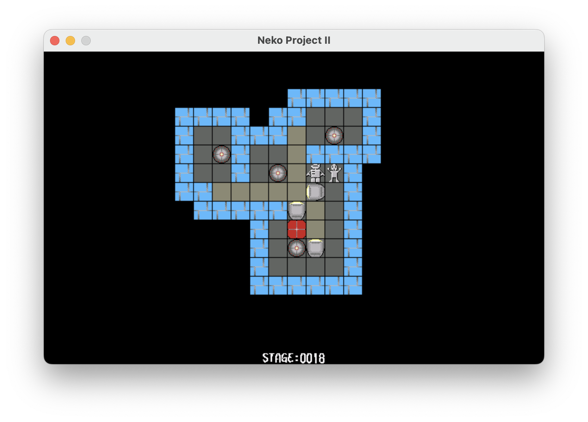

# Lad

A puzzle game.

Written in 1994 in x86 assembler for the NEC PC-9800 series.

## How to play

Execute `lad.com`.
I guess it requires `lstg.dat` in the current directory.

In 2024, I was able to run it with [Neko Project II] and [FreeDOS(98)].

[Neko Project II]: https://www.yui.ne.jp/np2/

[FreeDOS(98)]: http://bauxite.sakura.ne.jp/software/dos/freedos.htm

I guess `mkladstg.com` is a stage editor.
